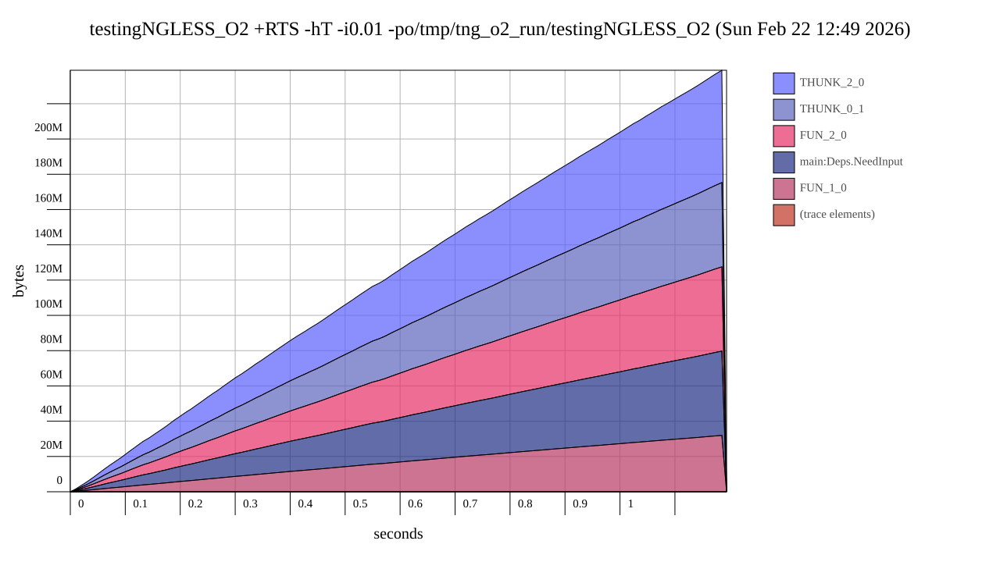
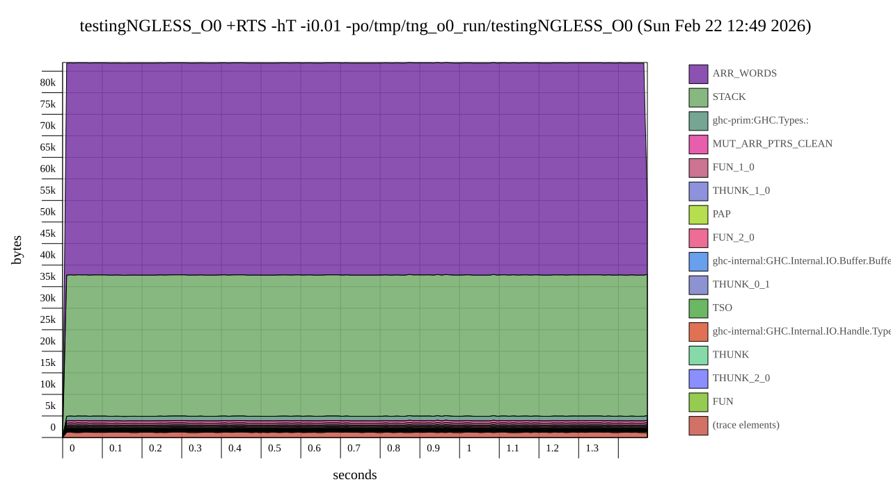

# Testing of -O2 pessimization with GHC

This code **uses linear space with -O2**, but runs in constant space without it.

This is a stripped down bit of [NGLess](http://ngless.embl.de) where this
strange behaviour was first observed.

Prerequisites: `ghc` and `hp2pretty` in `PATH`.

# Build with O2


Build with `-O2` and run


```bash
    ghc -prof -fprof-auto -rtsopts -O2 --make Execs/Main.hs -iNGLess -o /tmp/testingNGLESS_O2
    /usr/bin/time -v /tmp/testingNGLESS_O2 +RTS -hT -i0.01 -potestingNGLESS_O2 -RTS
    hp2pretty testingNGLESS_O2.hp
```

This is the result (increasing memory usage, up to 150M in 3.5 seconds):



# Build without O2

```bash
    ghc -prof -fprof-auto -rtsopts -O0 --make Execs/Main.hs -iNGLess -o /tmp/testingNGLESS_O0
    /usr/bin/time -v /tmp/testingNGLESS_O0 +RTS -hT -i0.01 -potestingNGLESS-FAST -RTS
    hp2pretty testingNGLESS-FAST.hp
```
This is the result (roughly stable memory usage, maximum usage around 11MB)



# RESULTS

The files `testingNGLESS_O2.svg` and `testingNGLESS-FAST.svg` show the memory
profiles of running the above.

Note that this is a small input file. On real data, memory usage is much higher
(several GBs).
